# Twelve Creative Server

Backend API for the Twelve Creative marketing website and its administrative content management system. The service is a modular, monolithic Express application written in TypeScript, backed by MongoDB, and deployed as a standalone process behind Nginx on a self-managed VPS.

This document describes the system as it exists in the codebase: the runtime architecture, the request lifecycle, the complete data model, the deployment pipeline, and the operational surface (environment variables, scripts, and tests). Every diagram in this document is followed by a written explanation of what it shows.

## Table of Contents

1. [Overview](#overview)
2. [Technology Stack](#technology-stack)
3. [System Architecture](#system-architecture)
4. [Request Lifecycle](#request-lifecycle)
5. [Project Structure](#project-structure)
6. [Module Anatomy](#module-anatomy)
7. [Authentication and Authorization](#authentication-and-authorization)
8. [Data Model](#data-model)
9. [Soft Deletion Lifecycle](#soft-deletion-lifecycle)
10. [Query Builder](#query-builder)
11. [File Upload and Media Pipeline](#file-upload-and-media-pipeline)
12. [Error Handling](#error-handling)
13. [Optional Messaging Infrastructure](#optional-messaging-infrastructure)
14. [API Surface](#api-surface)
15. [Environment Variables](#environment-variables)
16. [Getting Started](#getting-started)
17. [Available Scripts](#available-scripts)
18. [Testing](#testing)
19. [Deployment](#deployment)

## Overview

The server exposes a single REST API, mounted under `/api`, that serves two consumers:

- The public marketing website, which reads published content (industries, services, testimonials, case studies, blog posts, and page metadata) with no authentication.
- The administrative panel, which authenticates as a registered user and performs create, read, update, delete, and reorder operations against every content type in the system.

All content that appears on the public website — page heroes, shared narrative sections, industries, featured projects, testimonials, showcase videos, team members, brands, FAQs, insights, legal pages, and site-wide settings — is stored in MongoDB and managed exclusively through this API. There is no static content compiled into the frontend; the marketing site is a thin rendering layer over this service.

The codebase also carries a set of general-purpose, disabled-by-default subsystems (Redis caching, Kafka, RabbitMQ, Google Cloud Storage, Stripe, bKash, SSLCommerz) inherited from an internal starter template. Of these, only Redis and Google Cloud Storage are wired into active code paths, and both remain fully optional: the application starts and serves every route correctly with them turned off. The payment gateway configuration exists in the environment schema but is not referenced by any route, service, or model, since this project has no commerce surface.

## Technology Stack

| Concern | Choice |
| --- | --- |
| Language | TypeScript, compiled with `tsc` |
| Runtime | Node.js 24 |
| Web framework | Express 5 |
| Database | MongoDB, accessed through Mongoose 8 |
| Validation | Zod, one schema per endpoint |
| Authentication | JSON Web Tokens (access and refresh), bcrypt password hashing |
| Session storage | `express-session` with a MongoDB-backed store in production |
| File storage | Local disk by default, Google Cloud Storage as an alternate provider |
| Video processing | ffmpeg, invoked through `ffmpeg-static` and `ffprobe-static` |
| Caching (optional) | Redis |
| Messaging (optional) | Kafka, RabbitMQ |
| Testing | Jest with `@swc/jest`, Supertest for route-level tests |
| Process management | PM2, single Express process per environment |
| Reverse proxy | Nginx |

## System Architecture

<div align="center">

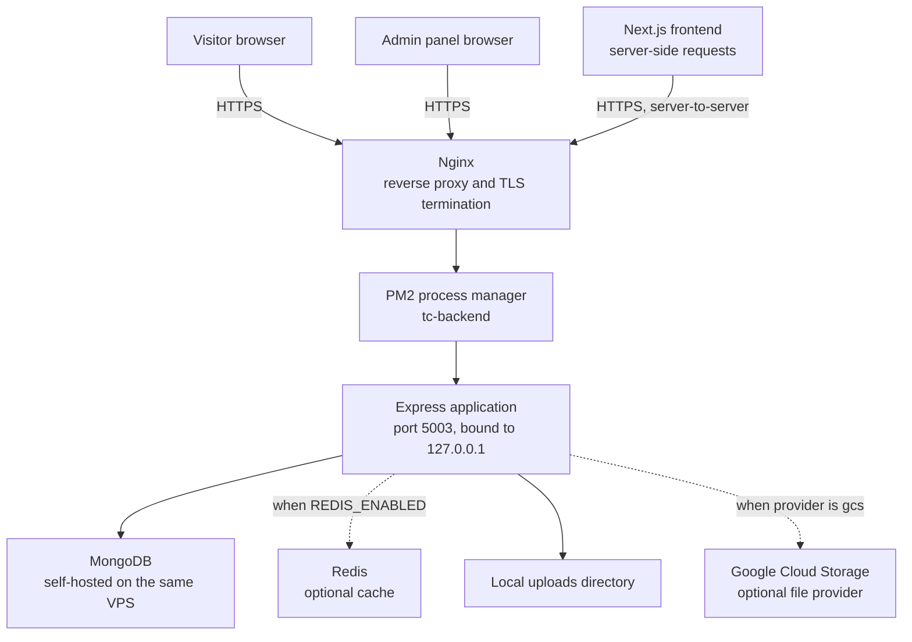

</div>

The Express application is a single process, managed by PM2 and never exposed directly to the internet: Nginx is the only public entry point and forwards traffic to `127.0.0.1:5003`. Both the public browser and the Next.js frontend's server-side rendering layer reach the API through the same Nginx host, over HTTPS. MongoDB runs on the same VPS as the application and is the only hard dependency the process requires to start. Redis, when enabled, is used to cache authenticated-user lookups so that every authenticated request does not need a database round trip to resolve the requesting user. File storage defaults to the local disk and can be switched to Google Cloud Storage per upload without any change to the API contract consumers see.

## Request Lifecycle

<div align="center">

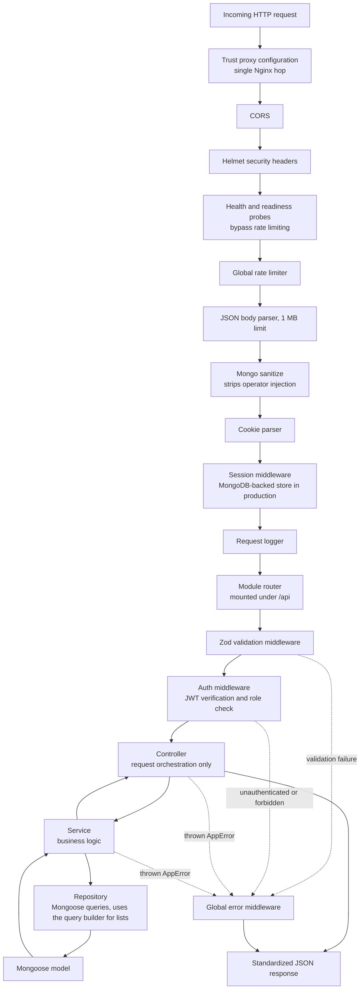

</div>

Every request passes through the same fixed middleware chain before reaching a route handler. CORS is registered first so that preflight requests never touch application logic. Health and readiness probes are placed ahead of rate limiting so that an overloaded instance still reports its true state to the process supervisor rather than a throttled response. Past that point, every module route follows the same five-stage pattern: a Zod validator parses and rejects malformed input before any handler code runs, an optional role-gated auth middleware verifies the JSON Web Token and attaches the requesting user to the request, a controller wrapped in a `catchAsync` helper delegates to a service with no business logic of its own, the service applies domain rules and calls a repository, and the repository is the only layer that touches Mongoose directly. Errors thrown anywhere in this chain — a Zod parsing failure, a thrown `AppError`, a Mongoose validation or cast error, or a duplicate-key error — are all caught by a single global error middleware that normalizes them into one response shape.

## Project Structure

```text
src/
  app.ts                    Express application assembly: middleware order and route mounting
  index.ts                  Process entry point: database connection, optional subsystems, HTTP server, clustering
  builder/                  AppError, AppQueryFind (the chainable query builder), AppAggregationQuery
  config/                   One file per external dependency: env, db, redis, kafka, rabbitmq, socket, trust-proxy
  constants/                Cross-module constants (upload policy, and similar)
  enums/                    Shared enumerations
  errors/                   Formatters that turn raw Mongoose and Zod errors into the standard error shape
  interface/                Express Request type augmentation (req.user)
  jobs/                     Scheduled job registry, currently empty
  middlewares/              Auth, validation, rate limiting, sanitization, logging, file upload, error handling
  modules/                  One directory per domain feature; see Module Anatomy
  providers/                Placeholder for third-party integrations
  routes/                   Aggregates every module router under /api
  scripts/                  One-off and maintenance scripts (seeding, patches, video compression)
  services/                 Cross-cutting service helpers
  templates/                Email templates
  types/                    Global TypeScript declarations (JWT payload, response envelope)
  utils/                    catchAsync, sendResponse, slugify, email sending, and similar helpers
```

Every feature lives inside its own directory under `src/modules/`. Code that only one module needs stays inside that module; code used by three or more modules is promoted to the shared directories listed above.

## Module Anatomy

<div align="center">

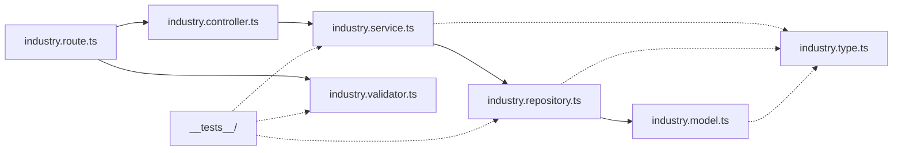

</div>

Every module in `src/modules/` follows the same internal file layout, shown here for the `industry` module as a representative example. The route file wires a validator and, where the operation is not public, an auth check, in front of a controller. The controller has no business logic; it exists only to call the corresponding service function and pass its result to `sendResponse`. The service holds every business rule, and is the only layer permitted to make decisions. The repository is the only file that imports the Mongoose model directly, and is responsible for translating a service's intent into a query, using the shared `AppQueryFind` builder for any list, search, or paginated read. The type file defines the module's TypeScript contracts and is imported by every other file in the module without exception. Each module carries its own `__tests__/` directory with `.spec.ts` files that exercise the service and repository layers in isolation.

## Authentication and Authorization

<div align="center">

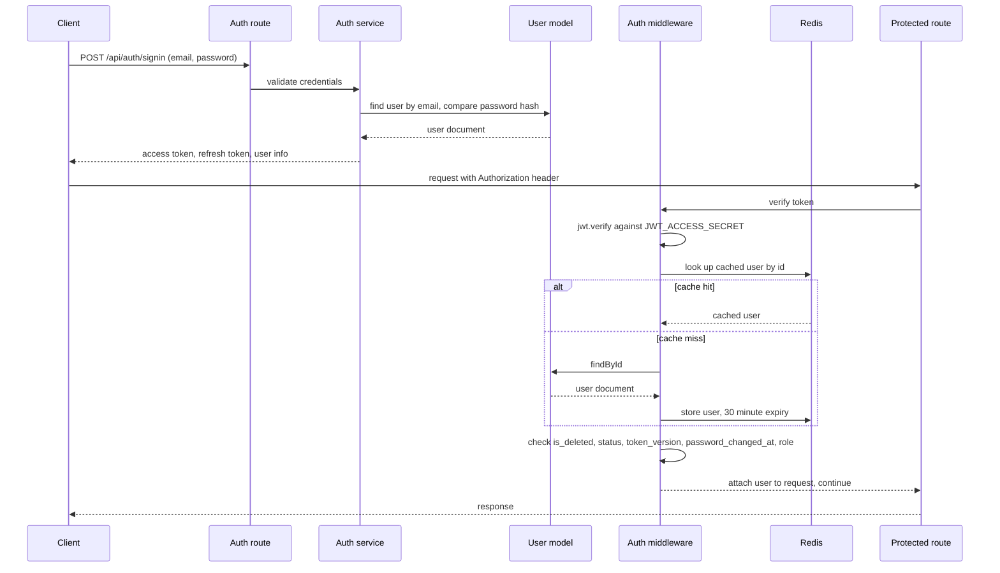

</div>

Authentication is stateless from the perspective of the API: a successful sign-in returns a short-lived JSON Web Token that the client presents on every subsequent request in an `Authorization` header. There is no server-side session used to authorize API calls; the session middleware registered in `app.ts` exists for infrastructure that expects a session cookie, not for authorization decisions. Every protected route is wrapped in an `auth(...roles)` middleware that verifies the token's signature and expiry, then performs five additional checks before allowing the request through: the referenced user must still exist, must not be soft-deleted, must not be blocked, must carry a `token_version` matching the user's current value (a global sign-out mechanism used to invalidate every outstanding token for a user at once), and must not have had their password changed after the token was issued. Only after all five checks pass does the middleware confirm the user's role is one of the roles the route requires. When Redis is enabled, the user lookup inside this middleware is cached for thirty minutes per user, keyed by user id, so that a burst of authenticated requests from the same admin session does not repeatedly hit MongoDB for the same document. There are two roles in the system: `admin`, which can reach every route, and `editor`, which is excluded from destructive user-management and system-configuration routes at the route-definition level.

## Data Model

<div align="center">

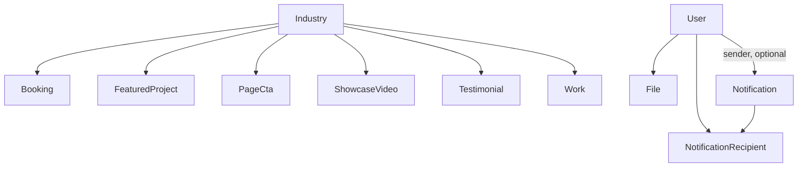

</div>

This diagram shows only the collections that participate in a foreign-key relationship, with the direction of each arrow read as "is referenced by." `Industry` is the hub of the content model: six collections carry an `ObjectId` reference to it, since almost every piece of public-facing content — a case study, a testimonial, a showcase reel, a featured project, a page call-to-action, and an inbound booking — is scoped to the industry it belongs to. `User` is referenced by three collections that record who authored an upload, who triggered a notification, and who a notification was delivered to. Every other collection in the system is intentionally standalone: either a singleton document (site-wide settings, the about page, the process section), a document keyed by a unique enum value rather than a relationship (a page hero keyed by page, a shared section keyed by section key, a legal page keyed by slug), or an independent content list with no foreign key of its own (brands, FAQs, insights, services, team members, tasks, tickets, and system logs).

<div align="center">

```mermaid
erDiagram
    Industry ||--o{ Booking : "scopes"
    Industry ||--o{ FeaturedProject : "scopes"
    Industry ||--o{ PageCta : "scopes"
    Industry ||--o{ ShowcaseVideo : "scopes"
    Industry ||--o{ Testimonial : "scopes"
    Industry ||--o{ Work : "scopes"
    User ||--o{ File : "uploads"
    User ||--o{ Notification : "sends"
    User ||--o{ NotificationRecipient : "receives"
    Notification ||--o{ NotificationRecipient : "delivered as"

    Industry {
        ObjectId _id PK
        string slug UK
        string name
        string headline
        string description
        string image
        string icon
        string_array work
        string cta_label
        string cta_href
        string tagline
        string thumbnail
        object video
        string reel_thumbnail
        object reel_video
        number order
        boolean is_active
        boolean is_deleted
        date deleted_at
        date created_at
        date updated_at
    }

    Booking {
        ObjectId _id PK
        string name
        string email
        string phone
        string company
        ObjectId industry_id FK
        string industry_name_snapshot
        string industry
        string timeline
        date preferred_date
        string preferred_time
        string message
        string status
        string internal_note
        string source
        string lead_source
        boolean is_deleted
        date deleted_at
        date created_at
        date updated_at
    }

    FeaturedProject {
        ObjectId _id PK
        string title
        ObjectId industry FK
        string aspect
        string thumbnail
        object video
        number order
        boolean is_active
        boolean is_deleted
        date deleted_at
        date created_at
        date updated_at
    }

    ShowcaseVideo {
        ObjectId _id PK
        ObjectId industry FK
        object video
        string thumbnail
        string alt
        string aspect
        number order
        boolean is_active
        boolean is_deleted
        date deleted_at
        date created_at
        date updated_at
    }

    Testimonial {
        ObjectId _id PK
        ObjectId industry FK
        string name
        string designation
        string image
        string category
        string message
        object video_message
        string thumbnail
        number order
        boolean is_active
        boolean is_deleted
        date deleted_at
        date created_at
        date updated_at
    }

    Work {
        ObjectId _id PK
        ObjectId industry FK
        string slug UK
        string type
        string title
        string description
        string image
        string image_alt
        object_array metrics
        string_array tag_slugs
        object_array hero_stats
        object client
        string situation_intro
        string challenge_intro
        object_array challenge_items
        string solution_intro
        object_array solution_phases
        string outcome_desc
        object outcome_video
        string outcome_video_thumbnail
        object testimonial
        string calendly_url
        number order
        boolean is_published
        boolean is_deleted
        date deleted_at
        date created_at
        date updated_at
    }

    PageCta {
        ObjectId _id PK
        string placement
        ObjectId industry FK
        string eyebrow
        string title
        string description
        string image
        object primary_cta
        object secondary_cta
        boolean is_active
        date created_at
        date updated_at
    }

    User {
        ObjectId _id PK
        string image
        string name
        string email UK
        string password
        string google_id UK
        string auth_source
        date password_changed_at
        string role
        string status
        boolean is_verified
        boolean is_deleted
        date deleted_at
        number token_version
        date created_at
        date updated_at
    }

    File {
        ObjectId _id PK
        string filename
        string originalname
        string name
        string url
        string mimetype
        number size
        ObjectId author FK
        string provider
        string category
        string description
        string caption
        string status
        boolean is_deleted
        date deleted_at
        object metadata
        date created_at
        date updated_at
    }

    Notification {
        ObjectId _id PK
        string title
        string message
        string type
        string priority
        string_array channels
        ObjectId sender FK
        date expires_at
        string status
        boolean is_deleted
        date deleted_at
        date created_at
        date updated_at
    }

    NotificationRecipient {
        ObjectId _id PK
        ObjectId notification FK
        ObjectId recipient FK
        object metadata
        boolean is_read
        date read_at
        boolean is_deleted
        date deleted_at
        date created_at
        date updated_at
    }

    Brand {
        ObjectId _id PK
        string name
        string logo
        string href
        number order
        boolean is_active
        boolean is_deleted
        date deleted_at
        date created_at
        date updated_at
    }

    Faq {
        ObjectId _id PK
        string question
        string answer
        string group
        number order
        boolean is_active
        boolean is_deleted
        date deleted_at
        date created_at
        date updated_at
    }

    Insight {
        ObjectId _id PK
        string slug UK
        string title
        string excerpt
        string cover
        string content
        string category
        number read_minutes
        string status
        date published_at
        boolean is_deleted
        date deleted_at
        date created_at
        date updated_at
    }

    Service {
        ObjectId _id PK
        string slug UK
        string title
        string description
        string_array highlights
        string image
        string icon
        string href
        number order
        boolean is_active
        boolean is_deleted
        date deleted_at
        date created_at
        date updated_at
    }

    TeamMember {
        ObjectId _id PK
        string name
        string role
        string bio
        string image
        object socials
        number order
        boolean is_active
        boolean is_deleted
        date deleted_at
        date created_at
        date updated_at
    }

    LegalPage {
        ObjectId _id PK
        string slug UK
        string title
        string markdown
        date effective_date
        object seo
        boolean is_published
        date created_at
        date updated_at
    }

    PageHero {
        ObjectId _id PK
        string page UK
        string label
        string title
        string description
        string thumbnail
        object video
        string trust_label
        object primary_cta
        object secondary_cta
        object seo
        boolean is_active
        date created_at
        date updated_at
    }

    SharedSection {
        ObjectId _id PK
        string key UK
        string label
        string title
        string description
        object content
        boolean is_active
        date created_at
        date updated_at
    }

    AboutPage {
        ObjectId _id PK
        string singleton_key UK
        object mission_section
        object mission
        object vision
        object story_section
        object_array story_cards
        object founder
        object gallery_section
        object_array gallery
        boolean is_active
        date created_at
        date updated_at
    }

    ProcessSection {
        ObjectId _id PK
        string singleton_key UK
        string label
        string title
        string description
        string thumbnail
        object_array process_steps
        date created_at
        date updated_at
    }

    SiteSetting {
        ObjectId _id PK
        string singleton_key UK
        string contact_email
        string contact_phone
        string contact_address
        string contact_whatsapp
        string contact_map_embed_url
        object social
        string booking_notification_email
        object faq_section
        string calendly_url
        string process_thumbnail
        string meeting_scene_image
        object content_section
        object contact_page
        object footer
        date created_at
        date updated_at
    }

    ContactMessage {
        ObjectId _id PK
        string name
        string email
        string phone
        string subject
        string message
        boolean is_read
        boolean is_archived
        boolean is_deleted
        date deleted_at
        date created_at
        date updated_at
    }

    Task {
        ObjectId _id PK
        string title
        string description
        string priority
        string status
        date due_date
        string created_by
        boolean is_deleted
        date deleted_at
        date created_at
        date updated_at
    }

    Ticket {
        ObjectId _id PK
        string title
        string description
        string priority
        string status
        string created_by
        boolean is_deleted
        date deleted_at
        date created_at
        date updated_at
    }

    SystemLog {
        ObjectId _id PK
        string level
        string message
        string actor
        object meta
        date created_at
    }
```

</div>

This is the complete entity relationship diagram for every collection in the database. Fields typed as `object` or `object_array` are embedded Mongoose sub-documents rather than separate collections or references; MongoDB stores them inline inside the parent document, and they are shown as a single row here to keep the diagram legible rather than expanded field by field. The recurring `object video` and `object video_message` fields share one shape across every model that has them: a `source` field constrained to `youtube`, `url`, or `upload`, and a `value` field holding the corresponding YouTube URL, direct URL, or uploaded file path — validated by a shared function so that, for example, a `url` source can never point at a non-HTTP(S) address and a `youtube` source can never hold anything but a recognized YouTube link shape. `object primary_cta` and `object secondary_cta` share a `{ label, href }` shape. `object seo` holds `{ title, description, og_image, canonical_url, no_index }`. `PageHero`, `SharedSection`, `AboutPage`, `ProcessSection`, and `SiteSetting` are each constrained to at most one document per key by a unique index — `page`, `key`, and `singleton_key` respectively — which is how the API can expose them as single objects rather than lists. `SharedSection` is a deliberately polymorphic collection: one schema, discriminated at the application layer by its `key` field, holds five structurally different kinds of content (a two-column comparison, a feature list, a growth-system step list, a scroll statement, and a work-with-us card list), with a `pre('validate')` hook enforcing that a document's `content` shape matches what its `key` requires.

## Soft Deletion Lifecycle

<div align="center">

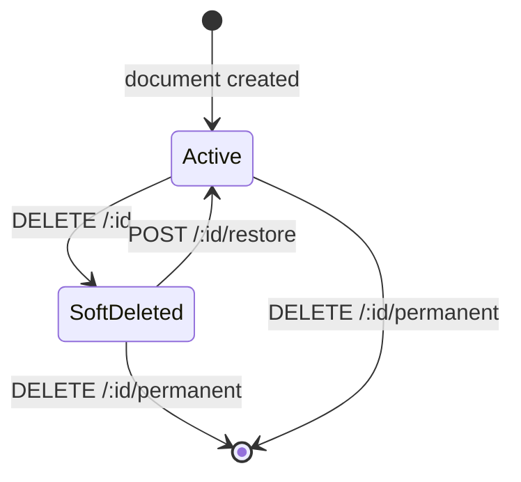

</div>

Every primary content collection uses soft deletion instead of physical removal as its default delete behavior: setting `is_deleted` to `true` and recording `deleted_at`, rather than removing the document from MongoDB. A Mongoose `pre('find')` hook, present on every soft-deletable model, silently adds `is_deleted: { $ne: true }` to every query that does not already specify `is_deleted`, so soft-deleted documents are invisible to every normal read path — the public API, the admin list view, and every internal lookup — without any individual query needing to remember to filter for it. The one deliberate escape hatch is a `bypassDeleted` query option that a small number of internal operations, such as the restore flow itself, set explicitly. A document reachable through this state machine can be restored back to active with a single `POST /:id/restore` call, which fails with a 404 if the document was never deleted, or removed permanently and irreversibly with `DELETE /:id/permanent`. As of this document, ten of the fifteen soft-deletable modules expose a restore route; the remaining five support the same underlying repository capability but do not yet have it wired into a route.

## Query Builder

<div align="center">

```mermaid
flowchart LR
    Params["Raw query parameters<br/>search, filter, sort, page, limit, fields"]
    New["new AppQueryFind(Model, params)"]
    Search["search(fields)<br/>case-insensitive regex OR across fields"]
    Filter["filter(fields)<br/>equality filters, plus $or / $and passthrough"]
    Sort["sort(fields)<br/>defaults to -created_at, always appends -_id"]
    Paginate["paginate()<br/>skip and limit from page and limit"]
    Fields["fields(fields)<br/>projection"]
    Populate["populate(config)<br/>optional, for reference expansion"]
    Execute["execute()"]
    Result["{ data, meta: { total, page, limit, total_pages } }"]

    Params --> New --> Search --> Filter --> Sort --> Paginate --> Fields --> Populate --> Execute --> Result
```

</div>

`AppQueryFind` is a chainable builder that every module's repository uses for list endpoints, so that search, filtering, sorting, pagination, and field projection behave identically across all twenty-six collections rather than being reimplemented per module. Each method returns the builder instance, so a repository composes only the stages a given endpoint needs. The sort stage carries two correctness guarantees that were added after a real production bug: MongoDB's storage order is not guaranteed to be stable across separate queries, so `skip`-and-`limit` pagination over an unsorted or non-uniquely-sorted collection can return the same document on two different pages, or skip a document entirely. The builder defends against this by always falling back to `-created_at` when no explicit sort is requested, and by always appending `-_id` as a final tiebreaker when the requested sort would not otherwise produce a total ordering — which matters in practice, since several collections have documents sharing the same `order` value or the same `created_at` timestamp from a bulk import. The `execute()` method issues the paginated document query and a count query together, computes `total_pages` from the same limit that was applied to the query, and can additionally return named statistics counts (used, for example, to show per-status counts alongside a filtered list) computed against the same base filter.

## File Upload and Media Pipeline

<div align="center">

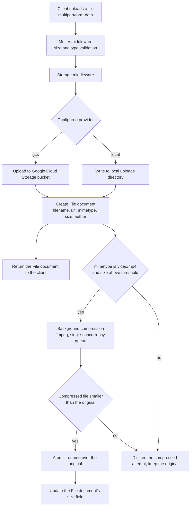

</div>

File uploads are accepted through Multer, validated for size and MIME type, and then written to whichever storage provider is configured: the local filesystem by default, or a Google Cloud Storage bucket when the request specifies it. Either path produces a `File` document recording the stored filename, its public URL, its MIME type and size, and the authenticated user who uploaded it, and this document is what the response returns immediately — the upload itself is never delayed by anything downstream. If the uploaded file is an MP4 video above an eight-megabyte threshold, a background compression pass is scheduled after the response has already been sent: a single-concurrency in-process queue re-encodes the file with `ffmpeg`, and only if the result is genuinely smaller than the original does it atomically replace the original file on disk and update the `File` document's recorded size; otherwise the original is left untouched. This pipeline was added after the site was found to be serving several video files well over one hundred megabytes to mobile visitors, and a companion one-off script (`compress-existing-videos.ts`) applies the same logic to every video uploaded before the pipeline existed, run manually and reporting its results before writing anything unless invoked with an explicit apply flag.

## Error Handling

<div align="center">

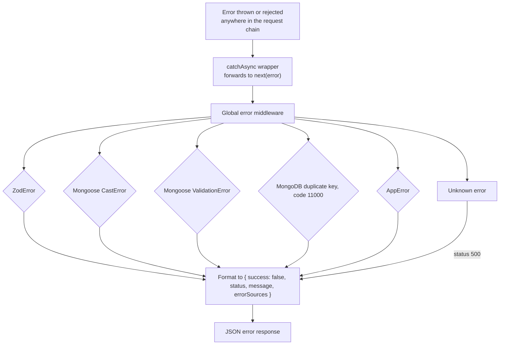

</div>

Every controller function is wrapped in a `catchAsync` helper, which exists solely to eliminate repetitive `try`/`catch` blocks: it wraps the handler's returned promise and forwards any rejection to Express's `next(error)`, which routes it to a single global error middleware regardless of where in the request chain it originated. That middleware recognizes five distinct error shapes and normalizes each into the same response envelope. A `ZodError` from the validation middleware and a Mongoose `ValidationError` from a failed schema constraint both become structured, per-field error messages. A Mongoose `CastError` — typically a malformed ObjectId in a route parameter — becomes a 400. A MongoDB duplicate-key error, identified by its `code: 11000`, is translated into a message naming the field that collided. A custom `AppError`, which every service throws directly for domain-level failures such as "not found" or "not deleted," carries its own explicit HTTP status and message through unchanged. Anything that does not match one of these becomes a generic 500 rather than leaking an internal error message or stack trace to the client.

## Optional Messaging Infrastructure

<div align="center">

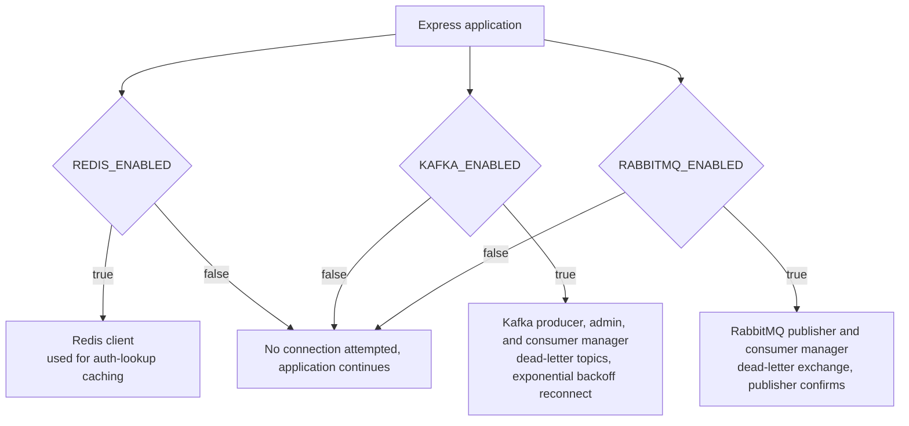

</div>

The codebase includes complete, production-grade client wrappers for Redis, Kafka, and RabbitMQ, each with reconnection backoff and, for the two message brokers, dead-letter handling for messages that fail processing. All three are gated behind an environment flag and are attempted only if that flag is set; if a flag is unset, or if the connection attempt fails, the relevant subsystem logs a warning and the application continues running normally rather than failing to start. In the current deployment, Redis is the only one of the three actually enabled, and its only consumer is the authenticated-user cache described in Authentication and Authorization above. Kafka and RabbitMQ are present and fully functional but are not currently published to or consumed from by any module in this codebase; they, along with the Stripe, bKash, and SSLCommerz configuration blocks in the environment schema, are inherited general-purpose infrastructure from the template this project was built from; none of the three payment gateways are referenced anywhere outside the environment configuration file, since the site has no commerce functionality.

## API Surface

The API exposes two hundred and fourteen routes across twenty-seven mount points, all under `/api`. The pattern is consistent across every content module: an unauthenticated `GET /public` (and, for slug-addressed content, `GET /public/:slug`) for the data the marketing website reads, and a full authenticated CRUD surface — list with search and pagination, get by id, create, update, soft delete, permanent delete, and, for ordered content, a reorder endpoint — for the admin panel.

| Mount | Purpose |
| --- | --- |
| `/api/auth` | Sign in, sign up, Google OAuth, token refresh, password reset, email verification |
| `/api/user` | User account management |
| `/api/industry` | Industries: the hub entity that scopes case studies, testimonials, reels, and CTAs |
| `/api/work` | Case studies |
| `/api/featured-project` | Short-form featured project reels |
| `/api/showcase-video` | Industry showcase video library |
| `/api/testimonial` | Client testimonials, text and video |
| `/api/service` | Service offerings |
| `/api/team-member` | Team roster |
| `/api/brand` | Client and partner brand logos |
| `/api/faq` | Frequently asked questions |
| `/api/insight` | Blog posts |
| `/api/booking` | Inbound call-booking submissions |
| `/api/contact-message` | Inbound contact form submissions |
| `/api/page-hero` | Per-page hero content, keyed by page |
| `/api/page-ctas` | Per-page and per-industry call-to-action blocks |
| `/api/shared-sections` | Polymorphic narrative sections reused across pages |
| `/api/about-page` | The About page, a single document |
| `/api/legal-pages` | Privacy policy and terms and conditions |
| `/api/process-section` | The process/methodology section, a single document |
| `/api/site-setting` | Site-wide contact, social, and footer configuration, a single document |
| `/api/file` | File upload and media library management |
| `/api/notification` | Internal notifications |
| `/api/notification-recipient` | Per-recipient notification delivery and read state |
| `/api/ticket` | Internal support tickets |
| `/api/task` | Internal task tracking |
| `/api/system-log` | Application-level audit log |

## Environment Variables

Every environment variable is read in exactly one place, `src/config/env.ts`, and re-exported through a single `config` object that the rest of the codebase imports from.

| Group | Variables |
| --- | --- |
| Server | `NODE_ENV`, `HOST`, `PORT`, `URL` |
| Database | `DATABASE_URL` |
| Security | `BCRYPT_SALT_ROUNDS`, `SESSION_SECRET`, `SERVER_API_KEY`, `DEFAULT_PASSWORD` |
| Admin seed | `ADMIN_SEED_NAME`, `ADMIN_SEED_EMAIL`, `ADMIN_SEED_PASSWORD` |
| JSON Web Tokens | `JWT_ACCESS_SECRET`, `JWT_ACCESS_SECRET_EXPIRES_IN`, `JWT_REFRESH_SECRET`, `JWT_REFRESH_SECRET_EXPIRES_IN`, `JWT_RESET_PASSWORD_SECRET`, `JWT_RESET_PASSWORD_SECRET_EXPIRES_IN`, `JWT_EMAIL_VERIFICATION_SECRET`, `JWT_EMAIL_VERIFICATION_SECRET_EXPIRES_IN` |
| Clustering | `CLUSTER_ENABLED` |
| Redis | `REDIS_ENABLED`, `REDIS_HOST`, `REDIS_PORT`, `REDIS_PASSWORD`, `REDIS_URL` |
| RabbitMQ | `RABBITMQ_ENABLED`, `RABBITMQ_URL` |
| Kafka | `KAFKA_ENABLED`, `KAFKA_BROKERS`, `KAFKA_CLIENT_ID` |
| CORS | `CORS_ORIGINS` |
| Frontend origins | `ADMINPANEL_URL`, `WEBSITE_URL` |
| UI links | `RESET_PASSWORD_UI_LINK`, `EMAIL_VERIFICATION_UI_LINK` |
| Email | `EMAIL`, `EMAIL_PROVIDER`, `SMTP_HOST`, `SMTP_PORT`, `SMTP_EMAIL`, `SMTP_EMAIL_PASSWORD`, `RESEND_EMAIL`, `RESEND_API_KEY`, `SENDGRID_EMAIL`, `SENDGRID_API_KEY` |
| Google OAuth | `GOOGLE_CLIENT_ID`, `GOOGLE_CLIENT_SECRET` |
| Google Cloud Storage | `GOOGLE_APPLICATION_CREDENTIALS`, `GOOGLE_CLOUD_STORAGE_BUCKET`, `GOOGLE_CLOUD_PROJECT_ID` |
| Local upload storage | `UPLOAD_DIR` |
| Unused, inherited from the template | `STRIPE_*`, `BKASH_*`, `SSLCOMMERZ_*` |

A complete, annotated template is kept at `.env.example` in the repository root.

## Getting Started

The project requires Node.js 24 and pnpm 10, pinned in `package.json` under `engines` and `packageManager`.

```bash
pnpm install
cp .env.example .env
# Fill in DATABASE_URL at minimum; every other variable has a safe default
# or gates an optional subsystem that is off unless explicitly enabled.
pnpm seed:initial
pnpm dev
```

`pnpm seed:initial` populates a fresh database with a complete set of industries, services, testimonials, case studies, and every singleton document the public site expects to find, so the API is immediately usable against real-shaped data rather than an empty database. `pnpm dev` starts the server with `ts-node-dev`, restarting on file changes.

## Available Scripts

| Script | Purpose |
| --- | --- |
| `pnpm dev` | Run the server in watch mode |
| `pnpm build` | Compile TypeScript to `dist/` |
| `pnpm start` | Run the compiled server from `dist/index.js` |
| `pnpm lint` / `pnpm lint:fix` | ESLint, with or without auto-fix |
| `pnpm prettier` / `pnpm prettier:fix` | Prettier formatting check or fix |
| `pnpm test` | Run the Jest suite once |
| `pnpm test:watch` | Run Jest in watch mode |
| `pnpm test:coverage` | Run Jest with a coverage report |
| `pnpm seed:admin` | Create or sync the seed admin account from environment variables |
| `pnpm seed:initial` | Populate a fresh database with a full content set |
| `pnpm seed:industry-media` | Idempotently patch industry reel media |
| `pnpm compress:videos` | One-off compression pass over already-uploaded videos; dry run unless invoked with `--apply` |

## Testing

The test suite is written with Jest and `@swc/jest`, and lives in a `__tests__/` directory inside every module and shared utility directory, using the `.spec.ts` suffix. Tests are unit-level throughout: repositories are tested against a mocked Mongoose model, and services are tested against a mocked repository, so the suite runs in a few seconds with no database connection required. At the time of writing, the suite contains nine hundred and eighty-two tests across ninety-seven files, all passing.

## Deployment

<div align="center">

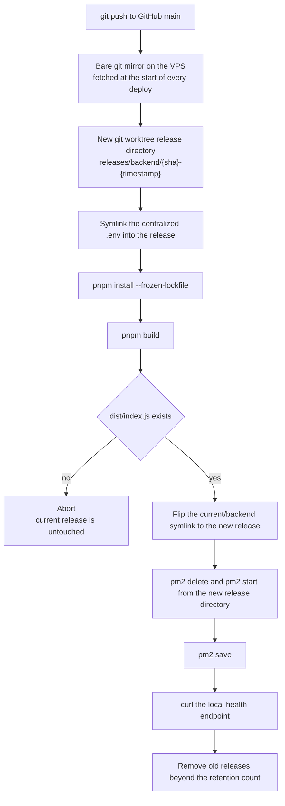

</div>

Deployment is atomic and self-hosted, driven by a single shell script (`deploy.sh`) run on the VPS. Each deploy fetches the latest `main` branch into a bare git mirror, then checks out that exact commit into a brand new directory using a git worktree rather than reusing the previous release's directory — every release is therefore immutable and independently addressable by its commit SHA and timestamp. Dependencies are installed and the project is built inside that new directory first; only if the build actually produces its expected output artifact does the script touch anything live, by repointing a `current` symlink at the new release and restarting the PM2 process from that new directory. A `pm2 start` from the new directory is used deliberately instead of `pm2 reload`, because `pm2 reload` does not repoint an already-running process to a new working directory — it would silently keep serving the old code from the old release. If a deploy fails at any point before the symlink flip, the live release is left running untouched and the partially-built release directory is discarded. After a successful deploy, `pm2 save` persists the process list so that a server reboot resurrects the correct release, and releases older than the retention count are pruned. The same script supports an explicit rollback command that repoints the symlink at a previous release directory and restarts PM2 from it, without needing a new build. In production, the compiled application runs as a single PM2-managed process named `tc-backend`, listening on `127.0.0.1:5003`, with Nginx as the only process with a public-facing listener.
